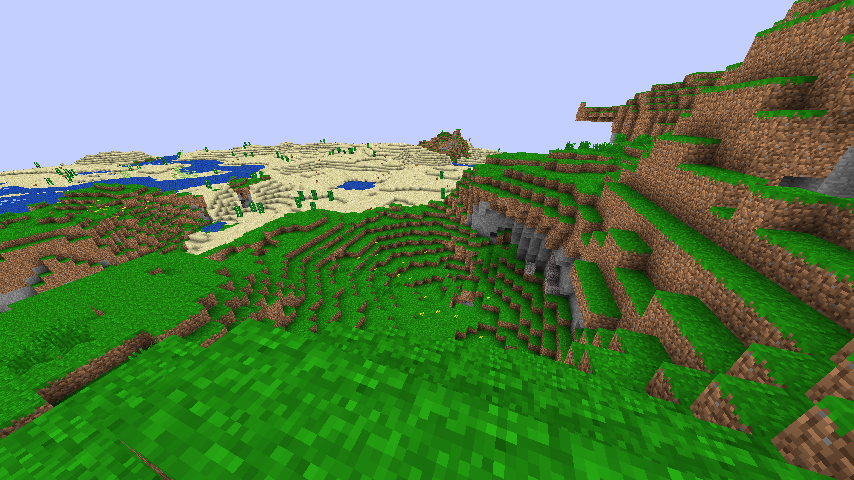
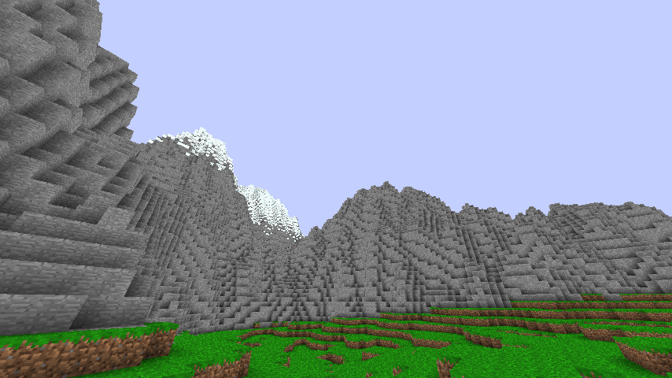
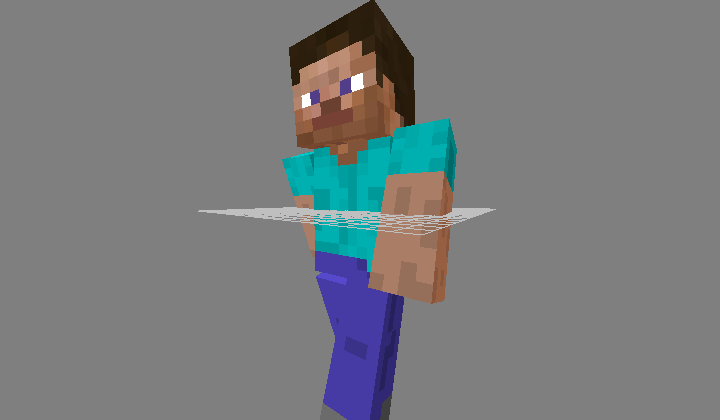

**mine3d - yet another Minecraft clone**

 * in early state of development
 * written in C with GCC extensions (gcc-4.6 required)
 * uses OpenGL, SDL and GLEW and ftgl
 * goals are simplicity, performance and compatibility with orginal Minecraft server

**Features:**

 * compatible with Minecraft protocol version 1.7.3
 * unlimited (limited by float accuracy, and Minecraft protocol) world in all three directions, cubic chunks
 * rendering of most solid blocks
 * player vs terrain collisions
 * simple server for testing purposes with simplex noise terrain generator

**Work in progres:**

 * entities
 * gui
 * digging and building

**Screenshoots:**

 
 
 
 
**Instalation:**

    export CC=gcc-4.6 make release
    make data
    ./server &
    ./client

**Controls:**

  * WASD or arrows - move
  * F - toggle flying
  * Escape - grab mouse
  * F11 - toggle fullscreen
  * F10 - quit

**Links:**

  * http://www.minecraft.net/
  * http://wiki.vg/Protocol
  * http://webstaff.itn.liu.se/~stegu/simplexnoise/simplexnoise.pdf

